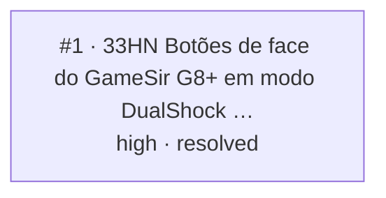

<!-- GENERATED, DO NOT EDIT: regenerado por /reversa-debugger-graph em 2026-09-22T15:10:36-03:00 a partir de 1 bugs -->

# Grafo de bugs · botoes-do-controle

## Clusters

Nenhum cluster: nenhum componente concentra mais de um bug.

## Impact score (heurística de triagem, não substitui priority/severity)

| Bug | causados×3 | bloqueados×2 | regressões×4 | relacionados×1 (máx. 3) | score |
|---|---|---|---|---|---|
