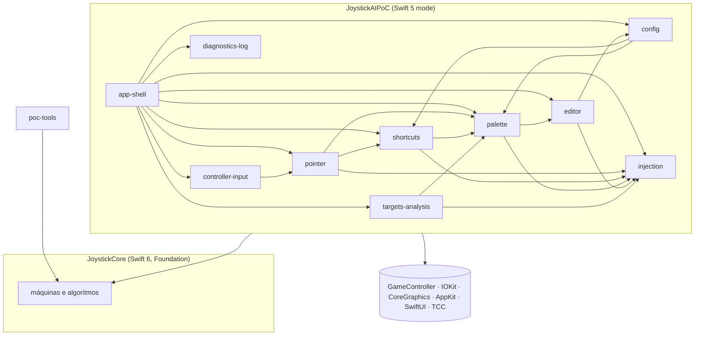
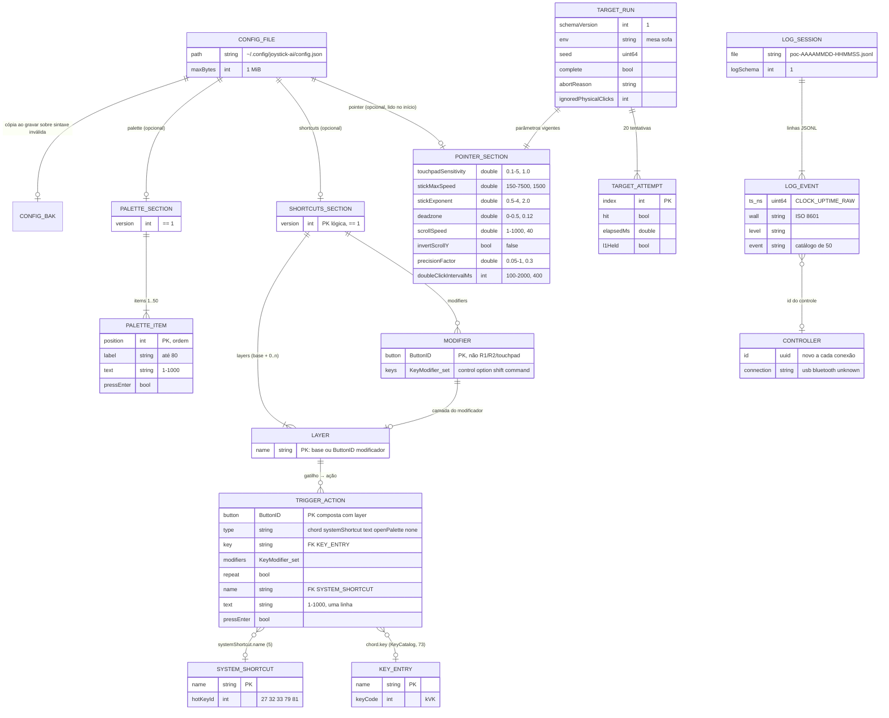

# Arquitetura — joystick-AI

> Gerado pelo Arquiteto em 2026-09-15 · Nível: completo
> Escala: 🟢 CONFIRMADO · 🟡 INFERIDO · 🔴 LACUNA
> Diagramas: [`c4-context.md`](c4-context.md), [`c4-containers.md`](c4-containers.md), [`c4-components.md`](c4-components.md). Impacto entre módulos: [`traceability/spec-impact-matrix.md`](traceability/spec-impact-matrix.md). Decisões: [`adrs/`](adrs/README.md).

## 1. Visão geral

O joystick-AI é um app agente para macOS 13+ escrito em Swift, sem dependências de terceiros, sem rede e sem banco de dados. Um único processo lê o DualSense em segundo plano, transforma as entradas em eventos sintéticos do CoreGraphics e oferece duas interfaces: a paleta flutuante, operada pelo controle, e o editor de atalhos em escala de TV. A configuração, os logs e os resultados de medição vivem em arquivos no diretório do usuário. 🟢

| Aspecto | Escolha | ADR |
|---------|---------|-----|
| Build | SwiftPM só com as Command Line Tools; bundle e assinatura por script | [001](adrs/001-swiftpm-sem-xcode-e-nucleo-puro.md), [002](adrs/002-assinatura-local-para-preservar-tcc.md) |
| Estrutura | Núcleo puro `JoystickCore` + app fino de integração + CLI de análise | [001](adrs/001-swiftpm-sem-xcode-e-nucleo-puro.md) |
| Entrada | `GameController` em segundo plano + `IOHIDManager` para PS e modo estendido | [003](adrs/003-gamecontroller-em-segundo-plano-com-hid-bruto.md), [004](adrs/004-controle-ativo-unico-por-ordem-de-conexao.md) |
| Saída | `CGEvent` em `.cghidEventTap` com marca `0x4A4F5953` | [005](adrs/005-injecao-por-cgevent-com-marca.md) |
| Tempo real | Fila serial `input`; temporizador único de 120 Hz sob demanda | [006](adrs/006-temporizador-unico-de-120hz-sob-demanda.md) |
| Permissão | `AXIsProcessTrusted` a cada 2 s + portão de injeção | [007](adrs/007-deteccao-de-permissao-por-axisprocesstrusted.md) |
| Persistência | JSON observado, fusão atômica; JSONL por sessão | [008](adrs/008-log-jsonl-tipado-sem-dados-sensiveis.md), [011](adrs/011-configuracao-em-json-com-camadas-e-validacao-conjunta.md), [012](adrs/012-gravacao-por-fusao-atomica-com-backup.md) |
| Interface | `NSPanel` não ativador; SwiftUI em `NSWindow` com ativação forçada | [010](adrs/010-paleta-em-painel-nao-ativador-que-so-digita.md), [013](adrs/013-ativacao-do-editor-por-janela-flutuante-e-clique-sintetico.md), [014](adrs/014-editor-swiftui-em-escala-de-tv.md) |

## 2. Estilo arquitetural

**Núcleo funcional com casca imperativa.** 🟢 Toda decisão de domínio mora em `struct` de valor no `JoystickCore`, que recebem entradas e devolvem efeitos (`MotionOutput`, `[ShortcutAction]`, `[PaletteEffect]`, `MouseAction?`). O app executa os efeitos: posta eventos, liga temporizadores, registra log e desenha. Essa separação permite 253 testes sem hardware e concentra a parte não testada nas bordas com o sistema operacional.

**Pipeline serializado por fila.** 🟢 Um evento do controle atravessa leitores → `InputRouter` → consumidores → injetores sempre na fila `input`, sem travas; a main thread cuida de AppKit, arquivos e permissões e fala com a fila só por `async` (duas exceções síncronas no sentido main → `input`, sem risco de impasse).

**Observador para configuração.** 🟢 `ConfigStore` é a fonte única da configuração vigente e notifica a fila `input` (`onApply`), o menu e o editor. A leitura e a gravação passam pelo mesmo validador (D-05 da 003), de modo que o editor e a edição manual obedecem às mesmas regras.

## 3. Camadas e dependências

A direção é única: o app depende do núcleo, nunca o contrário, e `JoystickCore` não importa nenhum framework além de `Foundation`. 🟢 O `app-shell` é o único ponto de montagem (injeção de dependências manual em `AppDelegate.applicationDidFinishLaunching`). 🟢

## 4. Integrações externas

Não há APIs REST, GraphQL, webhooks nem mensageria. Todas as integrações são com o sistema operacional ou por efeitos de entrada.

| # | Integração | Direção | Mecanismo | Formato | Tratamento de falha | Confiança |
|---|------------|---------|-----------|---------|---------------------|-----------|
| I-01 | `GameController` | entrada | `GCControllerDidConnect/Disconnect`, handlers por elemento, `shouldMonitorBackgroundEvents` | Objetos `GCDualSenseGamepad` | Controle não DualSense ignorado | 🟢 |
| I-02 | IOKit HID | entrada / consulta | `IOHIDManager` com casamento Sony `0x054C` e produtos `0x0CE6`/`0x0DF2`; `IOHIDDeviceGetReport` do recurso `0x05`; IORegistry para `Transport` | Relatórios binários `0x01` e `0x31` | `controller.extended_report` com código; transporte `unknown` | 🟢 |
| I-03 | CoreGraphics eventos | saída | `CGEvent.post(.cghidEventTap)` com `CGEventSource(.hidSystemState)` | Eventos de mouse, rolagem, teclado | Descartados em silêncio sem permissão | 🟢 |
| I-04 | CoreGraphics telas | entrada | `CGGetActiveDisplayList`, `CGDisplayBounds`, `CGDisplayRegisterReconfigurationCallback`, `CGWarpMouseCursorPosition` | Retângulos globais | Sem telas: sem limite | 🟢 |
| I-05 | TCC | consulta / pedido | `AXIsProcessTrusted`, `CGPreflightListenEventAccess`, `CGRequestPostEventAccess` | Booleanos | Portão de injeção; `permissions.guidance` | 🟢 |
| I-06 | Preferências do sistema | leitura | `CFPreferencesCopyAppValue("AppleSymbolicHotKeys", "com.apple.symbolichotkeys")` | Dicionário com `enabled` e `parameters` | Acorde padrão | 🟢 |
| I-07 | AppKit / WindowServer | saída | `NSStatusItem`, `NSPanel`, `NSWindow`, `NSWorkspace.frontmostApplication`, `NSApp.activate` | — | E003 para ativação recusada | 🟢 |
| I-08 | Raycast | saída indireta | Acorde ⌘M injetado pelo gatilho R3 | Atalho de teclado configurado pelo usuário | Nenhum: se o atalho mudar no Raycast, nada acontece | 🟢 |
| I-09 | Aplicativos em foco | saída indireta | Eventos de entrada e texto por `unicodeString` | — | Nenhum retorno | 🟢 |
| I-10 | Security | consulta | `SecCodeCopySelf` / informações de assinatura | Identidade, Team ID | Registrado em `session.start` | 🟢 |
| I-11 | `os.Logger` | saída | Subsistema `dev.iagoleal.joystick-ai.poc` | Texto | Só quando o arquivo de log não abre | 🟢 |
| I-12 | Sinais POSIX | entrada | `DispatchSource` para `SIGTERM`, `SIGINT`, `SIGHUP` | — | Limpeza idempotente e `exit(0)` | 🟢 |

## 5. Modelo de dados em arquivo

O sistema não tem banco de dados; as "entidades persistidas" são três formatos de arquivo. O detalhe campo a campo está em [`data-dictionary.md`](data-dictionary.md) §7, §9 e §10.

**Observações:** 🟢 `KEY_ENTRY` e `SYSTEM_SHORTCUT` são catálogos em código, não em arquivo; as "chaves estrangeiras" são nomes validados na leitura. 🟢 `CONTROLLER.id` só existe no log e muda a cada conexão, portanto não há identidade persistente do controle. 🟢 Não há migração de esquema: `version` diferente de 1 é recusado.

## 6. Qualidade e verificação

| Atributo | Mecanismo | Evidência | Confiança |
|----------|-----------|-----------|-----------|
| Correção da lógica | 253 testes Swift Testing no núcleo | `Tests/JoystickCoreTests/` (29 arquivos) | 🟢 |
| Correção da integração | Portões manuais com roteiro e log (PM-0 a PM-3 da 001; PM-1 da 002; PM-1a, PM-1b, PM-2 da 003) | `_reversa_forward/*/onboarding.md`, `actions.md` | 🟢 |
| Latência | `poc-tools latency` sobre `t_arrival`, `t_delivered`, `t_posted`; processamento p95 0,110 ms medido | `validation-report.md` 001:30 | 🟢 |
| Privacidade | Catálogo fechado de eventos sem coordenadas, textos ou acordes | `LogEventCatalogTests` | 🟢 |
| Robustez | Soltura sintética, portão de injeção, limpeza em sinais, configuração inválida nunca aplicada | `state-machines.md` §1, §2, §8 | 🟢 |
| Consumo | Temporizador só sob demanda; observação de arquivo sem polling | ADR-006, `ConfigWatcher` | 🟢 |

## 7. Dívidas técnicas

| # | Dívida | Tipo | Impacto | Local | Confiança |
|---|--------|------|---------|-------|-----------|
| TD-01 | Nenhum teste automatizado no alvo `JoystickAIPoC` (injetores, `ConfigStore`, `ConfigWatcher`, `ConfigWriter`, `EditorViewModel`, leitores do controle) | Ausência de testes em módulo crítico | Alto: fusão, link simbólico, `.bak` e conflito só são verificados manualmente | `Sources/JoystickAIPoC/` | 🟢 |
| TD-02 | `EditorViewModel.save(confirmBackup:)` grava sem reverificar `canSave`, e `ConfigStore` aplica sem revalidar | Invariante quebrável | Médio: configuração inválida pode ser aplicada e gravada | `EditorViewModel.swift:172` | 🟡 |
| TD-03 | PS lido pelo HID não identifica o controle de origem | Violação de regra (001 RN-01) | Baixo: só com dois DualSense | `ControllerReader.swift:38-44` | 🟡 |
| TD-04 | Nomes de PoC em produto: `JoystickAIPoC`, `poc-tools`, `poc-*.jsonl`, subsistema `…joystick-ai.poc` | Padrão inconsistente | Baixo agora; alto ao distribuir, porque o TCC e os caminhos dependem do nome | `Package.swift`, `DiagnosticLog.swift` | 🟢 |
| TD-05 | App em modo de linguagem Swift 5; isolamento garantido por `dispatchPrecondition`, não pelo compilador | Débito de concorrência | Médio ao migrar para Swift 6 estrito | `Package.swift` | 🟢 |
| TD-06 | `swift test` sem o script não executa testes nas CLT e sai com 0 | Armadilha de ferramenta | Médio: falso verde fora do script | `scripts/test.sh`, `Package.swift` (`unsafeFlags`) | 🟢 |
| TD-07 | Log sem rotação nem limpeza; `info` sem teto | Operação | Baixo: 5,8 MB em 43 sessões | `DiagnosticLog.swift` | 🟢 |
| TD-08 | `pointer` só é lido no início, ao contrário de `shortcuts` e `palette` | Padrão inconsistente | Baixo; documentado em 003 RN-10 | `AppDelegate.swift:50` | 🟢 |
| TD-09 | `TargetAbortMonitor` substitui `displayMonitor.onChange` e `gate.onSuspended` em vez de encadear | Acoplamento frágil | Baixo hoje | `TargetAbortMonitor.swift:24-38` | 🟢 |
| TD-10 | `TargetSession` usa `NSApp.activate(ignoringOtherApps:)`, recusado no macOS 26 a partir do controle | Inconsistência com a E003 | Médio para medir precisão | `TargetSession.swift:54` | 🟡 |
| TD-11 | `PaletteTab` usa `offset` como identidade de linha | Bug latente de UI | Baixo | `PaletteTab.swift:21` | 🟡 |
| TD-12 | Comentário "a confirmar" sobre Options e Create, já confirmado na P-05 | Documentação desatualizada no código | Baixo | `ButtonReader.swift:7` | 🟢 |
| TD-13 | Specs de origem desatualizadas: 001 RN-11 (R1/R2), 001 D-15 (P-08) e specs greenfield `sdd/pointer-control.md`, `sdd/action-mapping.md`, `sdd/voice-dictation.md` | Divergência spec × código | Médio para quem ler só as specs antigas | `_reversa_forward/001…`, `_reversa_sdd/sdd/` | 🟢 |
| TD-14 | `ConfigWriter` lê o arquivo existente sem o limite de 1 MiB | Validação inconsistente | Baixo | `ConfigWriter.swift` | 🟡 |
| TD-15 | Sem CI: build, testes e assinatura só locais | Processo | Baixo para uso pessoal | — | 🟢 |
| TD-16 | Tela de alvos nunca completou uma rodada; PM-3 da 001 parcial | Validação pendente | Médio: o risco de precisão do PRD segue sem número | `target-runs/` vazio | 🟢 |

## 8. Lacunas

| # | Lacuna |
|---|--------|
| 🟢 L-01 | Destino do componente `voice-dictation`: superado pelo atalho R3 → ⌘M do Raycast (ver `domain.md` §8 e ADR-015) |
| 🔴 L-02 | TD-02, TD-03 e a postagem do acorde padrão para atalho de sistema desativado são comportamento aceito ou defeito? |
| 🔴 L-03 | As medições pendentes (tela de alvos, latência de entrada ao movimento, CPU em movimento, 100 ciclos) continuam no plano? |
