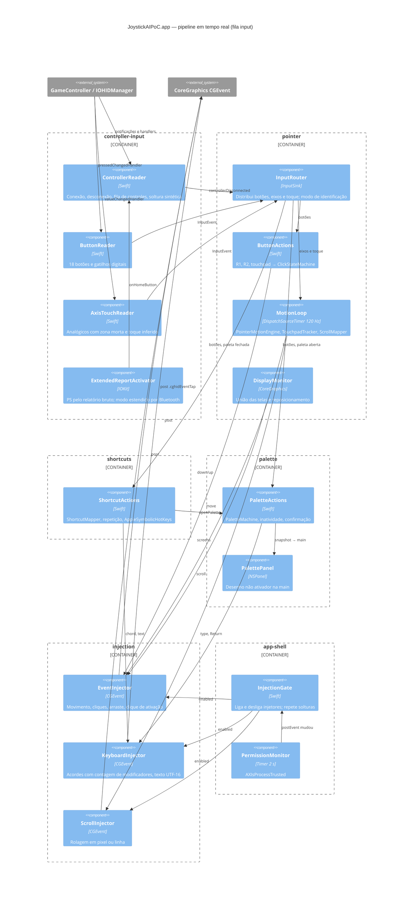
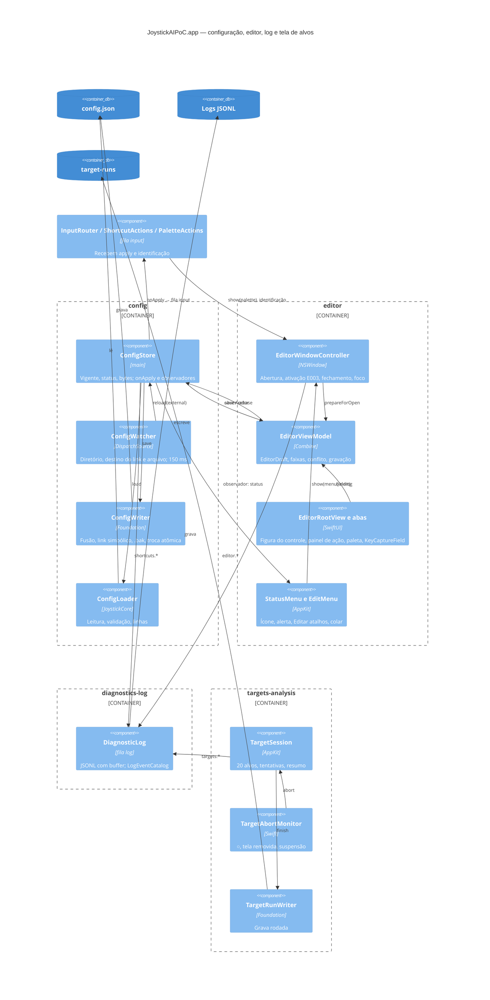

# C4 — Nível 3: Componentes

> Gerado pelo Arquiteto em 2026-09-15 · Escala: 🟢 CONFIRMADO · 🟡 INFERIDO · 🔴 LACUNA
> Componentes agrupados pelos 10 módulos da extração. Nomes em `code` são tipos reais.

## 1. `JoystickAIPoC.app`: pipeline de entrada e saída

## 2. `JoystickAIPoC.app`: configuração, editor e instrumentação (main thread)

## 3. `JoystickCore`: máquinas e algoritmos

| Módulo | Componentes | Responsabilidade | Testes |
|--------|-------------|------------------|--------|
| controller-input | `ActiveControllerRegistry`, `DualSenseReport`, `Normalization`, `TriggerTracker`, `StartupAdoption`, `InputEvent` | Fila de controles, PS por HID, zona morta, gatilho digital, adoção | 5 arquivos 🟢 |
| pointer | `PointerMotionEngine`, `StickKinematics`, `TouchpadTracker`, `ClickStateMachine`, `ScrollMapper`, `ScreenUnion`, `Geometry`, `PointerSettings` | Cinemática, subpixel, toque, cliques, rolagem, limite | 6 arquivos 🟢 |
| shortcuts | `ShortcutMapper`, `KeyCatalog`, `KeyRepeat`, `SystemShortcut` | Camadas, resolução no pressionar, acordes de sistema | 2 arquivos 🟢 |
| palette | `PaletteMachine`, `PaletteItem`, `PaletteDefaults` | Estado da paleta | 1 arquivo 🟢 |
| config | `ConfigLoader`, `PointerSettingsValidation`, `ShortcutConfig`, `ShortcutConfigValidation`, `ConfigLineLocator`, `ConfigDocument`, `ShortcutDefaults`, `ActionSummary` | Leitura, validação, localização, codificação, padrões, resumos | 8 arquivos 🟢 |
| editor | `EditorDraft` | Rascunho, operações e problemas | 1 arquivo 🟢 |
| app-shell | `LaunchArguments` | Argumentos de abertura | 1 arquivo 🟢 |
| diagnostics-log | `LogEvent`, `LogEventCatalog`, `JSONValue`, `MonotonicClock` | Esquema do log e JSON determinístico | 2 arquivos 🟢 |
| targets-analysis | `TargetRun`, `LatencyStats`, `LogAnalysis`, `RunsReport` | Rodadas, percentis, análise de log | 4 arquivos 🟢 |

Nenhum componente do alvo `JoystickAIPoC` tem teste automatizado; sua verificação é feita pelos portões manuais (`architecture.md` §6). 🟢
