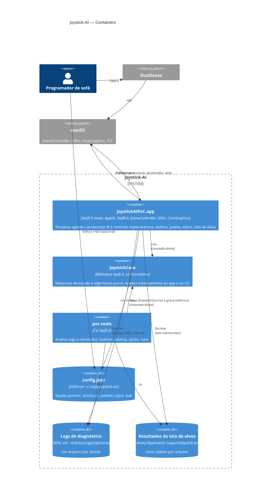

# C4 — Nível 2: Containers

> Gerado pelo Arquiteto em 2026-09-15 · Escala: 🟢 CONFIRMADO · 🟡 INFERIDO · 🔴 LACUNA

## Diagrama

## Containers

| Container | Tecnologia | Responsabilidade | Build / execução | Confiança |
|-----------|------------|------------------|------------------|-----------|
| `JoystickAIPoC.app` | Executável SwiftPM em modo Swift 5; AppKit, SwiftUI, Combine, GameController, IOKit, CoreGraphics, Security, UniformTypeIdentifiers | Todo o comportamento em tempo real e a interface | `scripts/build-app.sh` monta o bundle, assina com a identidade local e instala em `~/Applications/`; `LSUIElement` | 🟢 |
| `JoystickCore` | Biblioteca SwiftPM em modo Swift 6, só `Foundation` | Entrada normalizada, cinemática, cliques, atalhos, paleta, configuração, rascunho do editor, catálogo de log, análise | Ligada estaticamente; testada por `JoystickCoreTests` (29 arquivos, 253 `@Test`) via `scripts/test.sh` | 🟢 |
| `poc-tools` | Executável SwiftPM em modo Swift 6 | Relatórios de validação a partir dos arquivos | `swift run poc-tools <subcomando>` | 🟢 |
| `config.json` | JSON UTF-8, até 1 MiB | Configuração do usuário; criado só ao salvar no editor | Observado sem polling | 🟢 |
| Logs JSONL | JSON Lines | Diagnóstico e medições, sem dados sensíveis | Sem rotação | 🟢 |
| `target-runs/*.json` | JSON, `schemaVersion` 1 | Rodadas da tela de alvos | Diretório vazio no Mac do usuário | 🟢 |

## Execução e concorrência no app

| Contexto | Componentes | Comunicação |
|----------|-------------|-------------|
| main thread | `AppDelegate`, `ConfigStore`, `ConfigWatcher`, `StatusMenu`, `PalettePanel`, editor, `TargetSession`, `DisplayMonitor`, `PermissionMonitor`, `ExtendedReportActivator` | `async` para a fila `input`; `sync` só em `Lifecycle.cleanUp` e `TargetSession.recordAttempt` |
| fila `input` (serial, `userInteractive`) | Leitores do controle, `InputRouter`, `ButtonActions`, `MotionLoop` (120 Hz), `ShortcutActions`, `PaletteActions`, `InjectionGate`, injetores | `async` para a main; nunca `sync` |
| fila `log` (serial, `utility`) | `DiagnosticLog` | `async` a partir de qualquer contexto |

Fonte: `code-analysis.md` §0.1. 🟢
