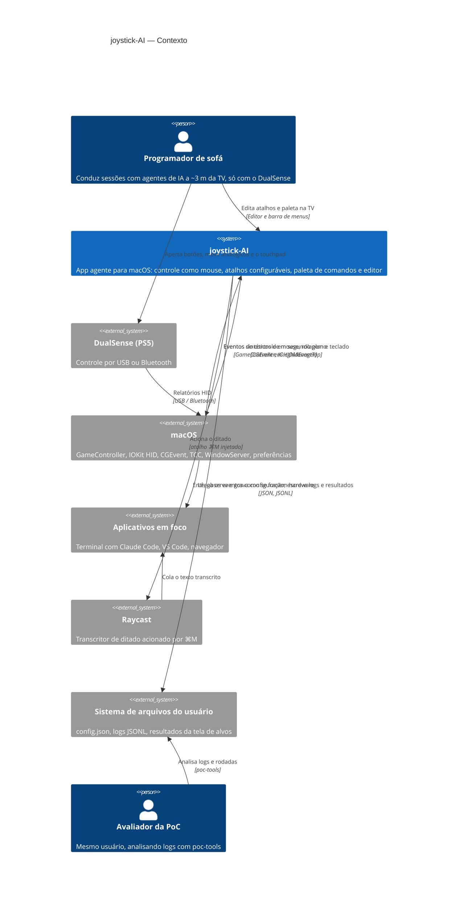

# C4 — Nível 1: Contexto

> Gerado pelo Arquiteto em 2026-09-15 · Escala: 🟢 CONFIRMADO · 🟡 INFERIDO · 🔴 LACUNA

## Diagrama

## Atores e sistemas

| Elemento | Tipo | Papel | Confiança |
|----------|------|-------|-----------|
| Programador de sofá | Pessoa | Único usuário; opera tudo pelo controle, inclusive o editor (`personas.md`) | 🟢 |
| Avaliador da PoC | Pessoa | O mesmo usuário em outro papel: roda os portões manuais e o `poc-tools` | 🟢 |
| DualSense | Hardware externo | Fonte de entrada; 18 botões, 2 analógicos, touchpad de 2 dedos | 🟢 |
| macOS | Plataforma | Entrega o controle, recebe os eventos sintéticos e controla permissões (TCC) | 🟢 |
| Aplicativos em foco | Sistemas externos | Destino dos eventos; o app não se integra a nenhum por API | 🟢 |
| Raycast | Sistema externo | Transcrição de voz; integração só por atalho de teclado configurado pelo usuário | 🟢 |
| Sistema de arquivos | Armazenamento | Único "banco de dados": três locais fixos em `~` | 🟢 |

## Fronteiras

- 🟢 Sem rede: nenhum uso de `URLSession`, sockets ou serviços remotos.
- 🟢 Sem API pública: o app não expõe porta, esquema de URL nem serviço XPC.
- 🟢 Integração com aplicativos só por eventos de entrada; o app não sabe qual aplicativo recebe os eventos, exceto o que guarda para devolver o foco ao fechar o editor.
