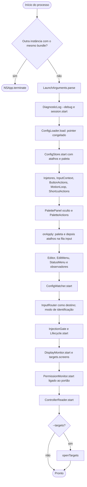
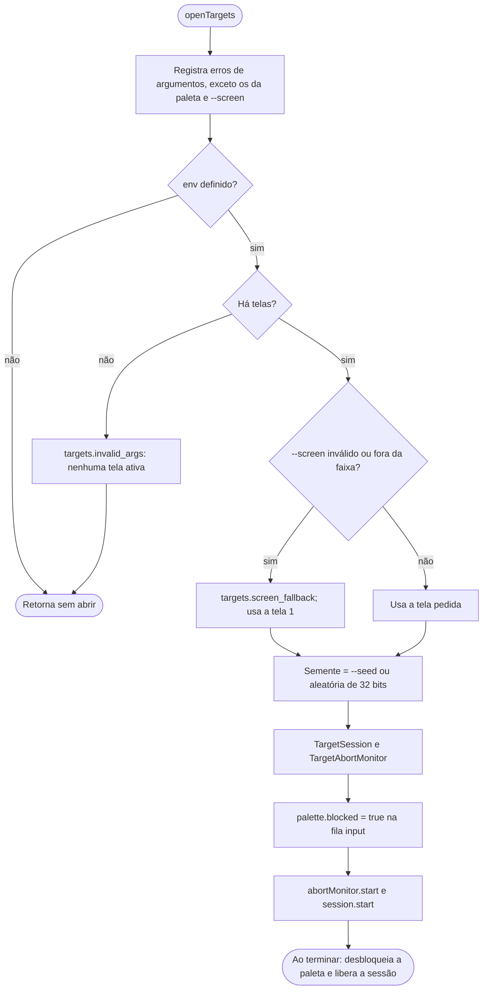
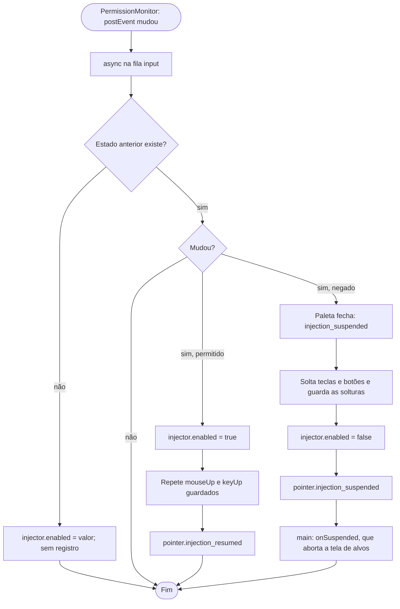
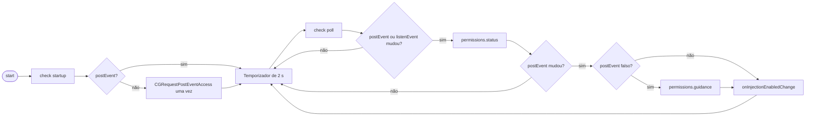
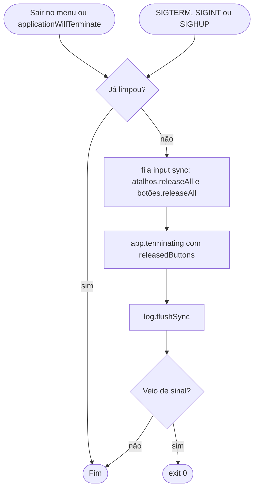

# Fluxogramas — `app-shell`

> Gerado pelo Arqueólogo em 2026-09-15. Fonte: `AppDelegate.swift`, `InjectionGate.swift`, `Lifecycle.swift`, `PermissionMonitor.swift`. 🟢

## 1. Inicialização (`applicationDidFinishLaunching`)

## 2. `openTargets`

## 3. Portão de injeção (`InjectionGate.setAllowed`)

## 4. Consulta de permissões

## 5. Encerramento

