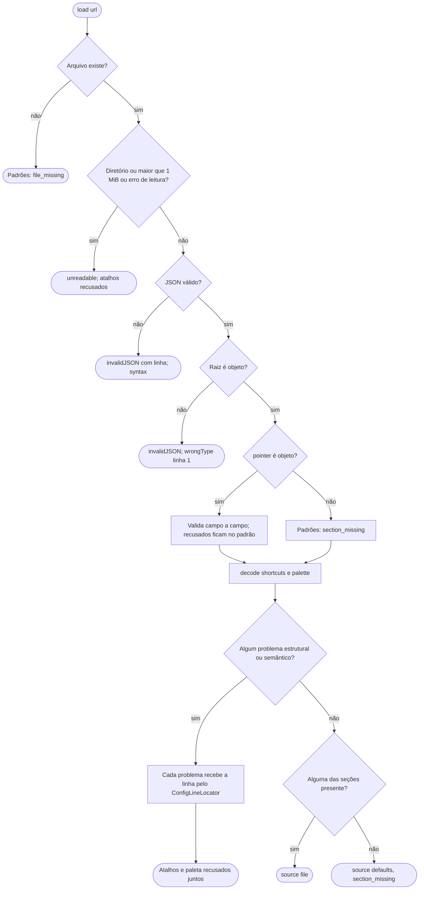
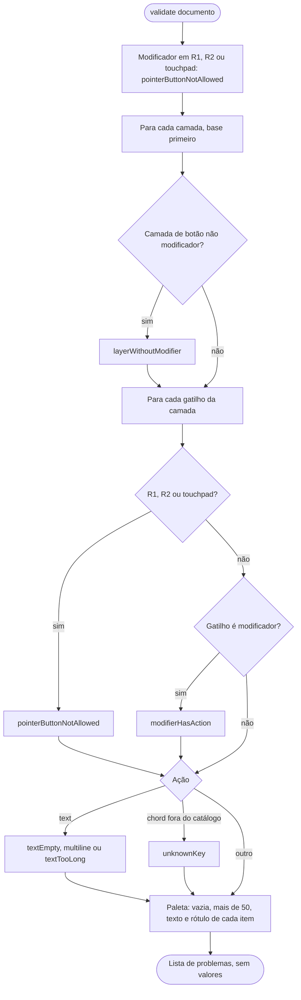
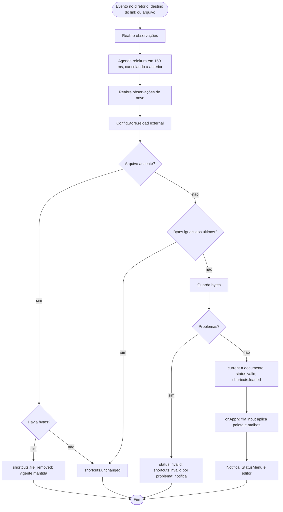
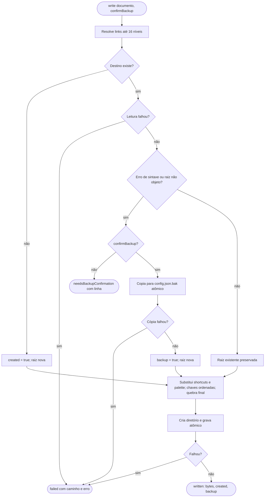

# Fluxogramas — `config`

> Gerado pelo Arqueólogo em 2026-09-15. Fonte: `ConfigLoader.swift`, `ShortcutConfigValidation.swift`, `ConfigStore.swift`, `ConfigWatcher.swift`, `ConfigWriter.swift`. 🟢

## 1. Leitura (`ConfigLoader.load`)

## 2. Validação semântica

## 3. Releitura por observação

## 4. Gravação (`ConfigWriter.write`)

