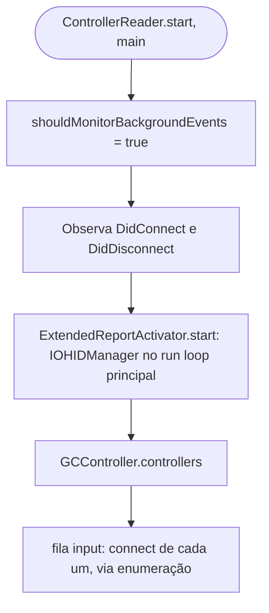
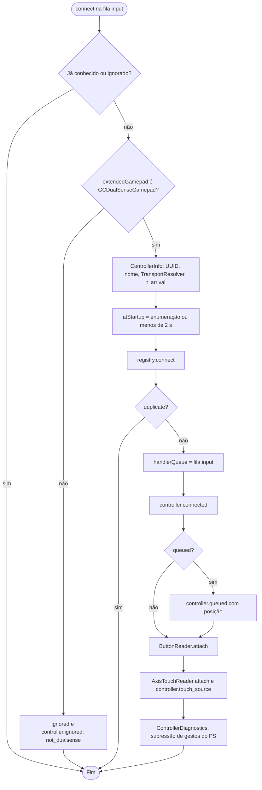
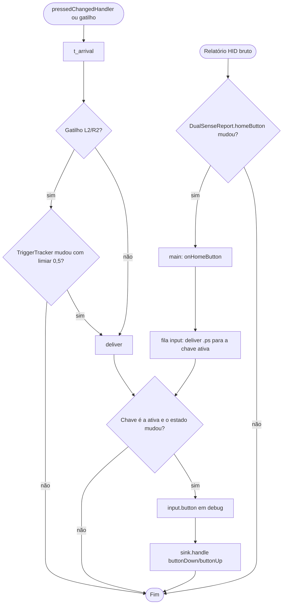
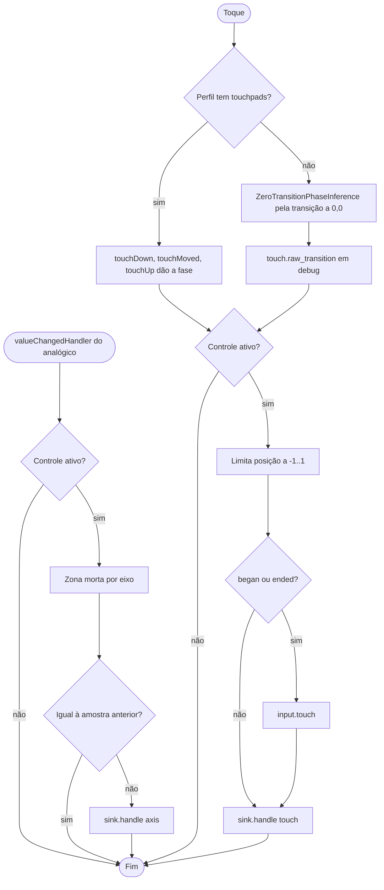
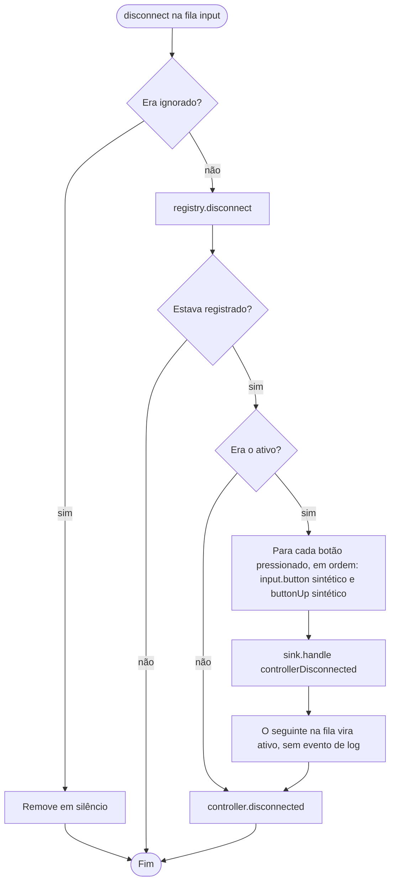
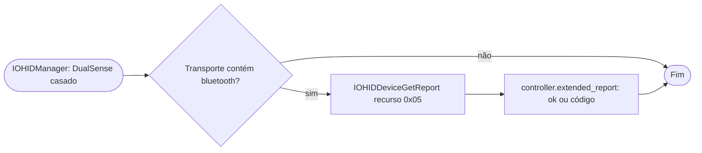

# Fluxogramas — `controller-input`

> Gerado pelo Arqueólogo em 2026-09-15. Fonte: `ControllerReader.swift`, `ButtonReader.swift`, `AxisTouchReader.swift`, `ExtendedReportActivator.swift`, `ActiveControllerRegistry.swift`. 🟢

## 1. Partida do leitor

## 2. Conexão

## 3. Botão

## 4. Analógicos e toque

## 5. Desconexão

## 6. Bluetooth: relatório estendido

