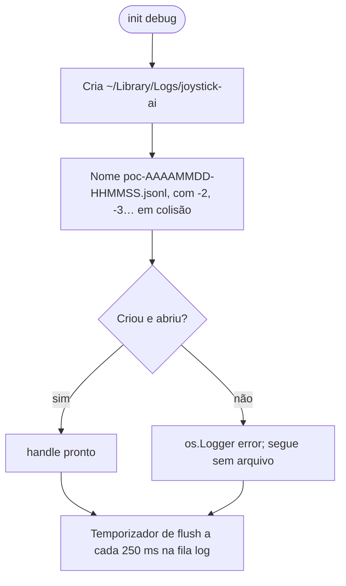
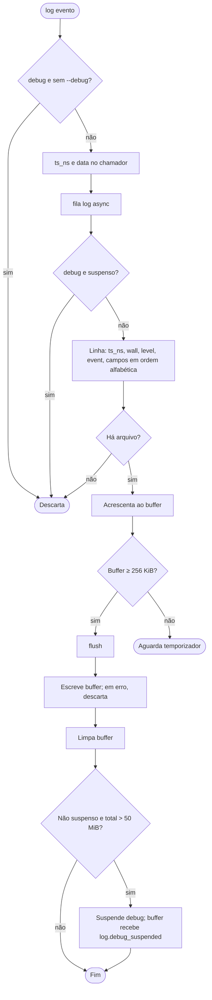

# Fluxogramas — `diagnostics-log`

> Gerado pelo Arqueólogo em 2026-09-15. Fonte: `DiagnosticLog.swift`, `LogEvent.swift`. 🟢

## 1. Abertura

```mermaid
flowchart TD
    A([init debug]) --> B[Cria ~/Library/Logs/joystick-ai]
    B --> C["Nome poc-AAAAMMDD-HHMMSS.jsonl, com -2, -3… em colisão"]
    C --> D{Criou e abriu?}
    D -- sim --> E[handle pronto]
    D -- não --> F[os.Logger error; segue sem arquivo]
    E --> G[Temporizador de flush a cada 250 ms na fila log]
    F --> G
```

## 2. Registro e descarga

```mermaid
flowchart TD
    A([log evento]) --> B{debug e sem --debug?}
    B -- sim --> Z([Descarta])
    B -- não --> C[ts_ns e data no chamador]
    C --> D[fila log async]
    D --> E{debug e suspenso?}
    E -- sim --> Z
    E -- não --> F[Linha: ts_ns, wall, level, event, campos em ordem alfabética]
    F --> G{Há arquivo?}
    G -- não --> Z
    G -- sim --> H[Acrescenta ao buffer]
    H --> I{Buffer ≥ 256 KiB?}
    I -- sim --> J[flush]
    I -- não --> Z2([Aguarda temporizador])

    J --> K[Escreve buffer; em erro, descarta]
    K --> L[Limpa buffer]
    L --> M{Não suspenso e total > 50 MiB?}
    M -- sim --> N[Suspende debug; buffer recebe log.debug_suspended]
    M -- não --> Z3([Fim])
    N --> Z3
```
