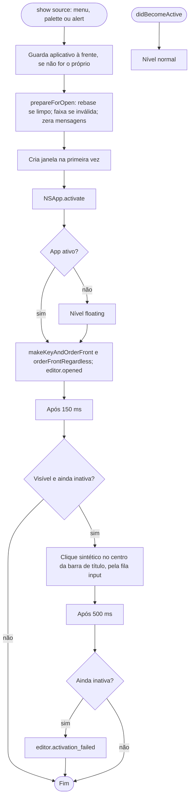
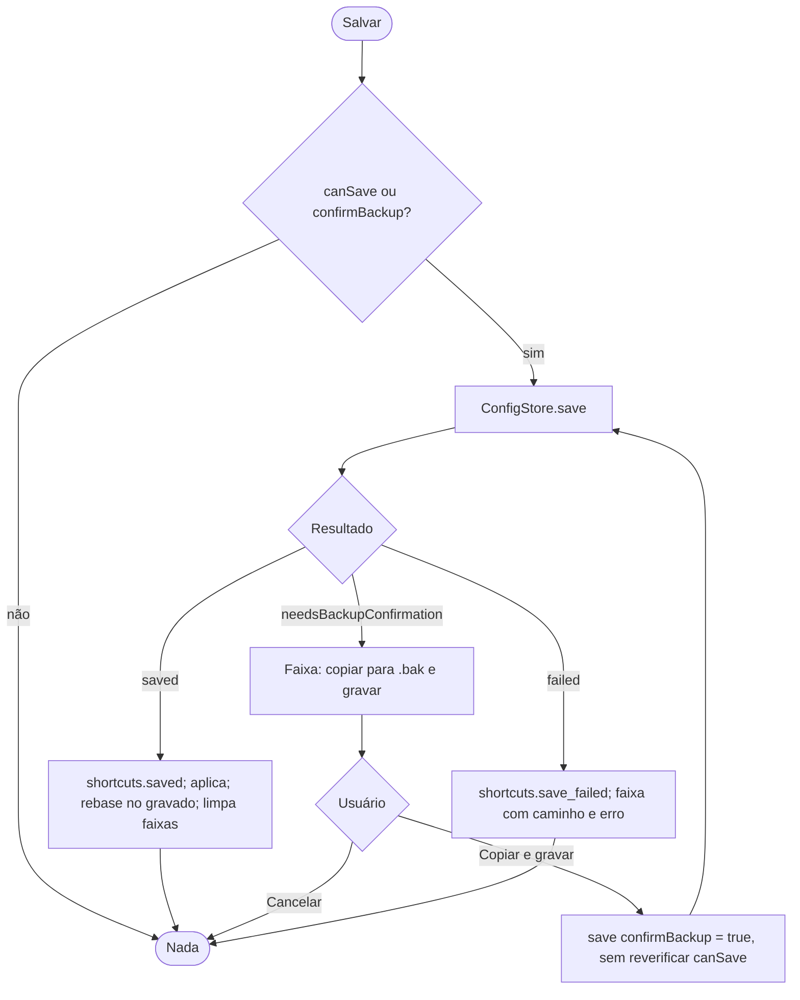
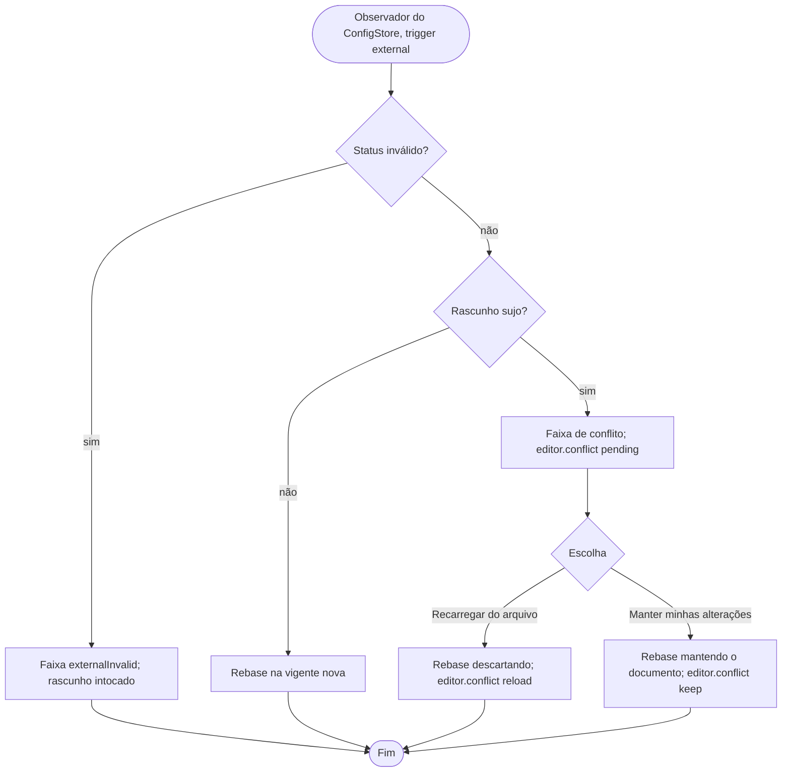
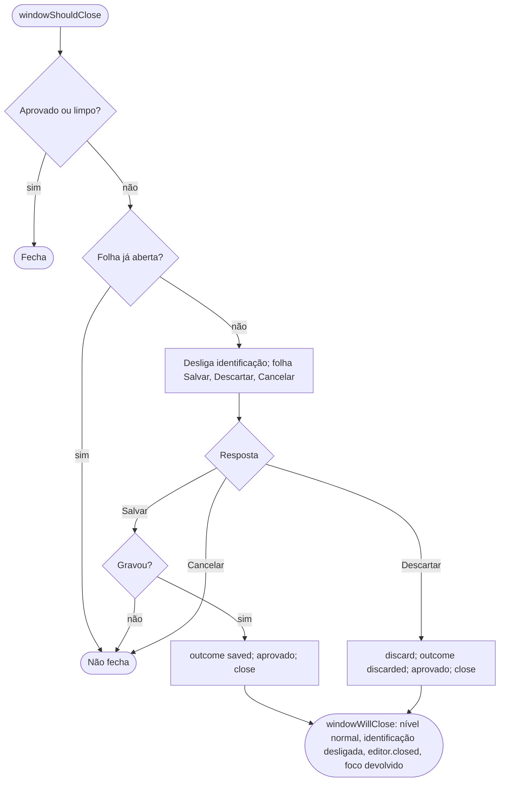
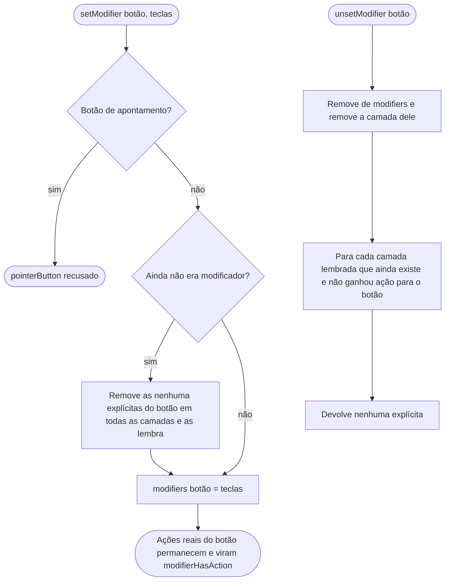
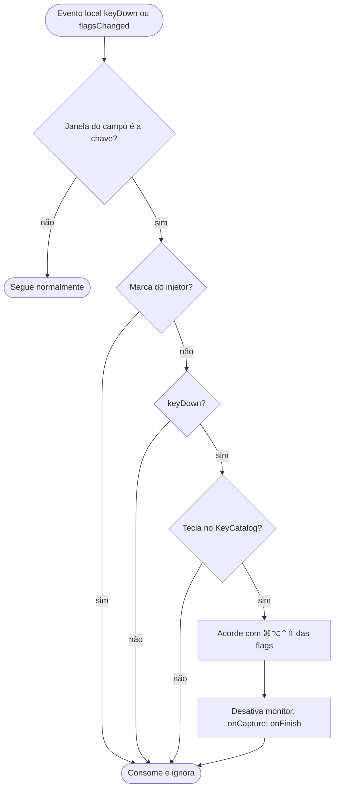

# Fluxogramas — `editor`

> Gerado pelo Arqueólogo em 2026-09-15. Fonte: `EditorWindowController.swift`, `EditorViewModel.swift`, `EditorDraft.swift`, `KeyCaptureField.swift`. 🟢

## 1. Abertura e ativação da janela

## 2. Gravação e confirmação da cópia

## 3. Mudança externa do arquivo

## 4. Fechamento

## 5. Marcar e desmarcar modificador (`EditorDraft`)

## 6. Gravação de acorde pelo teclado

