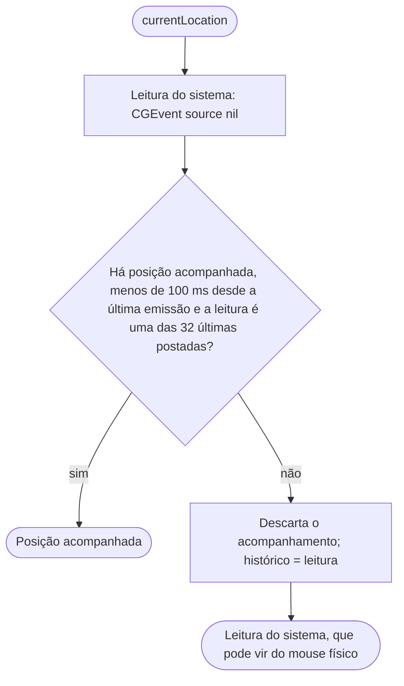
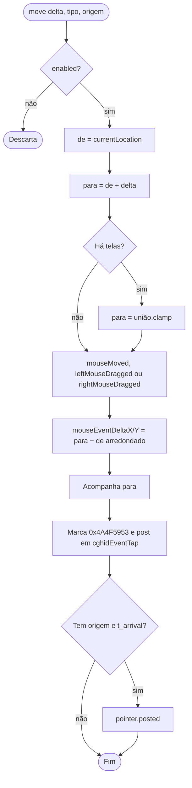
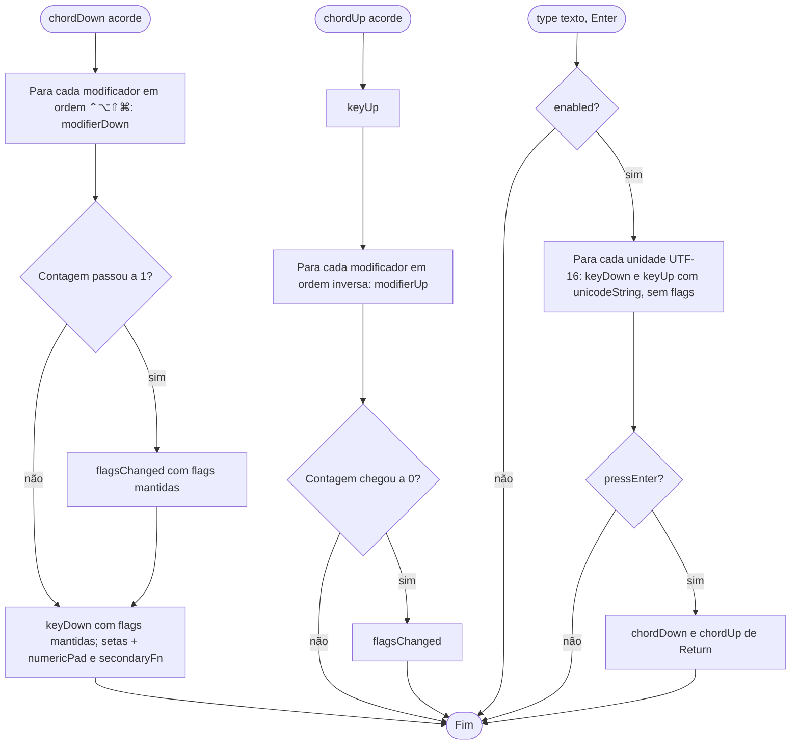
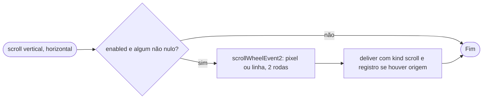

# Fluxogramas — `injection`

> Gerado pelo Arqueólogo em 2026-09-15. Fonte: `EventInjector.swift`, `KeyboardInjector.swift`, `ScrollInjector.swift`. 🟢

## 1. Posição de partida (`currentLocation`)

## 2. Movimento

## 3. Teclado

## 4. Rolagem

