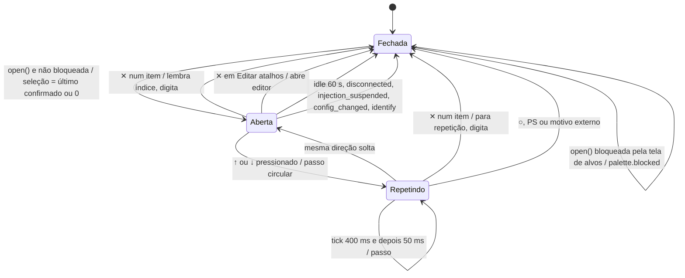
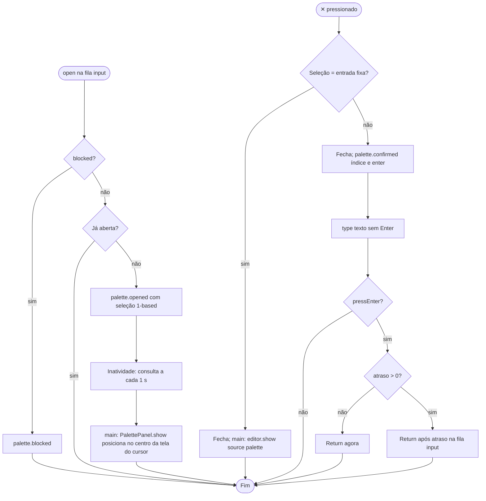
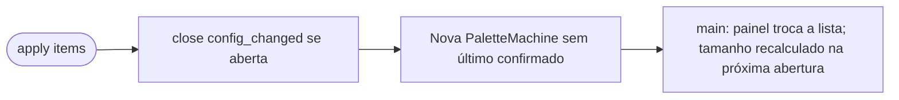

# Fluxogramas — `palette`

> Gerado pelo Arqueólogo em 2026-09-15. Fonte: `CommandPalette.swift`, `PaletteActions.swift`, `PalettePanel.swift`. 🟢

## 1. Máquina de estados

## 2. Abertura e confirmação

## 3. Configuração nova

