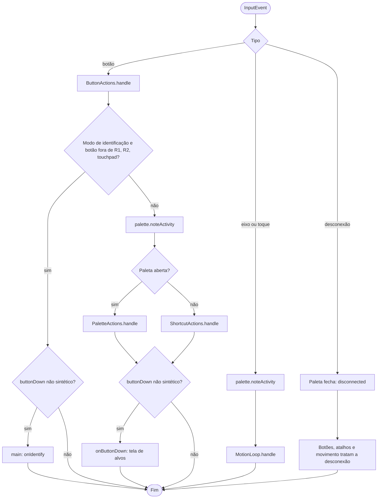
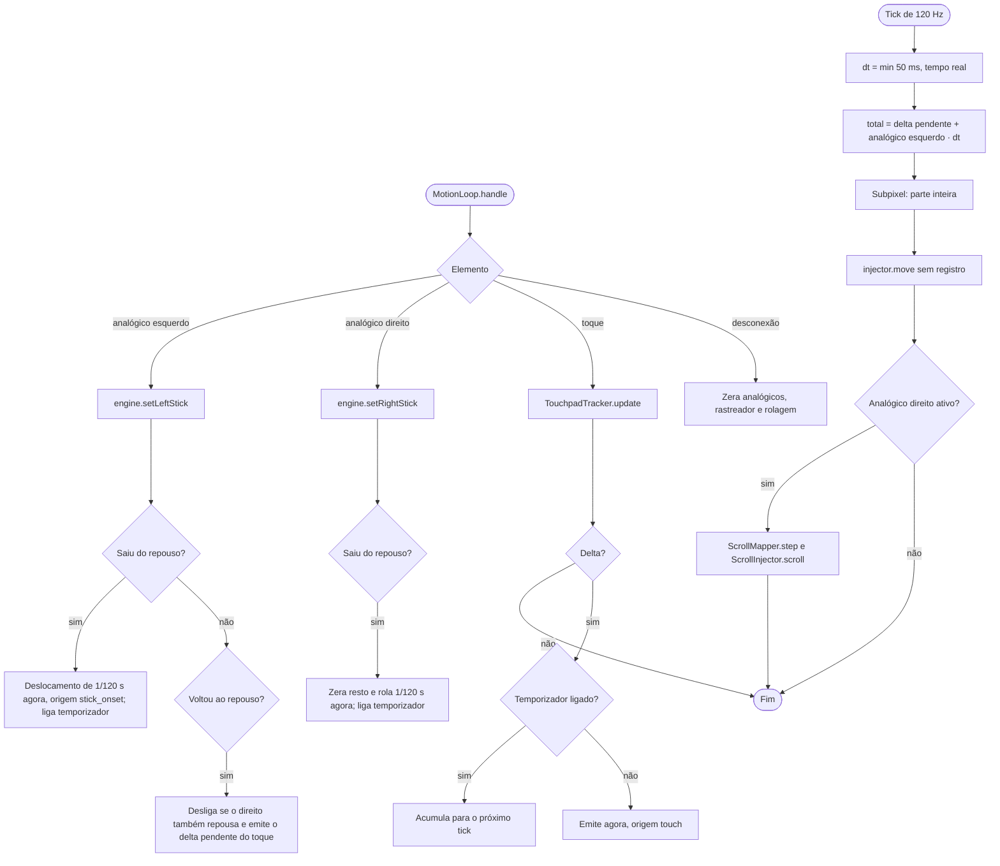
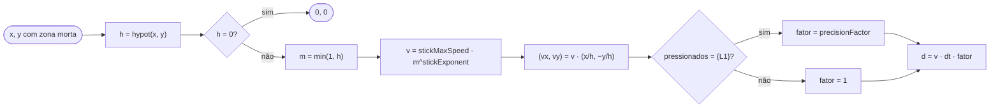
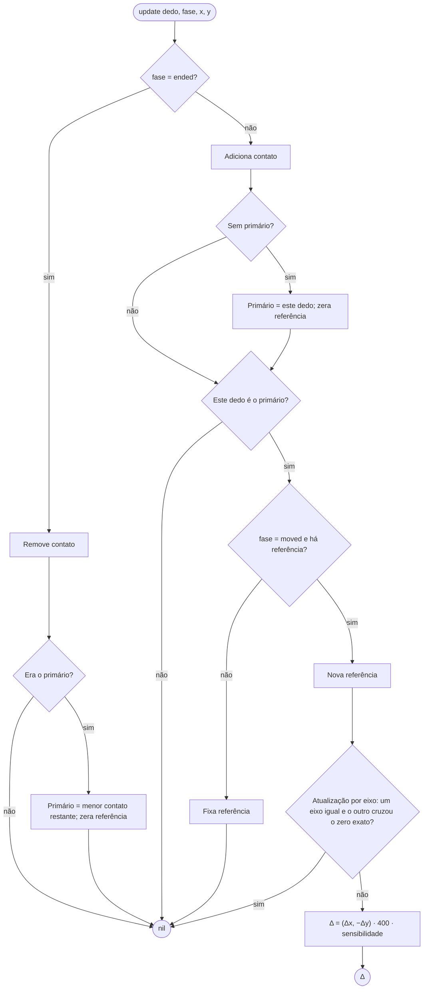
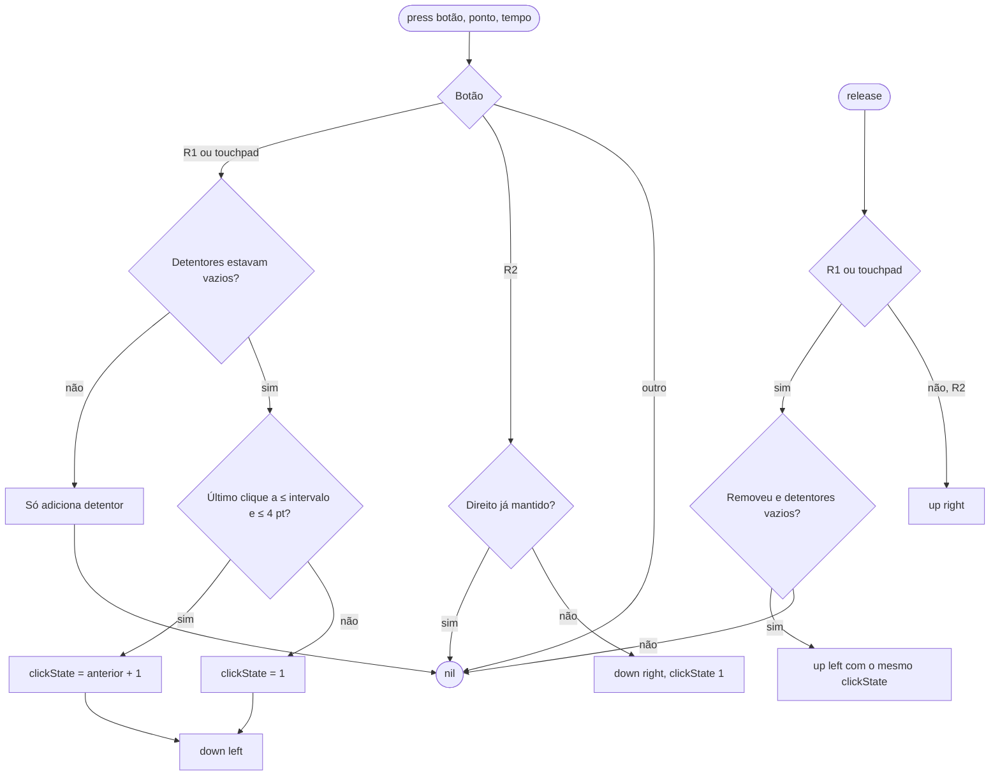
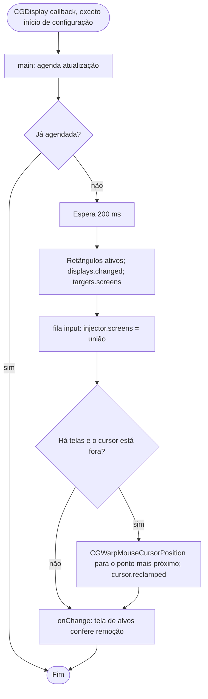

# Fluxogramas — `pointer`

> Gerado pelo Arqueólogo em 2026-09-15. Fonte: `InputRouter.swift`, `MotionLoop.swift`, `PointerMotionEngine.swift`, `TouchpadTracker.swift`, `ClickStateMachine.swift`, `DisplayMonitor.swift`. 🟢

## 1. Roteamento de entradas (`InputRouter.handle`)

## 2. Movimento e temporizador

## 3. Cinemática do analógico

## 4. Rastreador do touchpad

## 5. Cliques

## 6. Reconfiguração de telas

