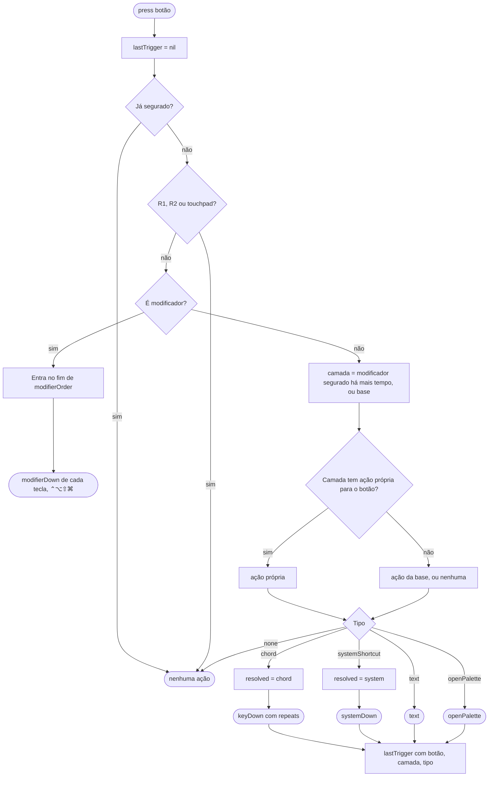
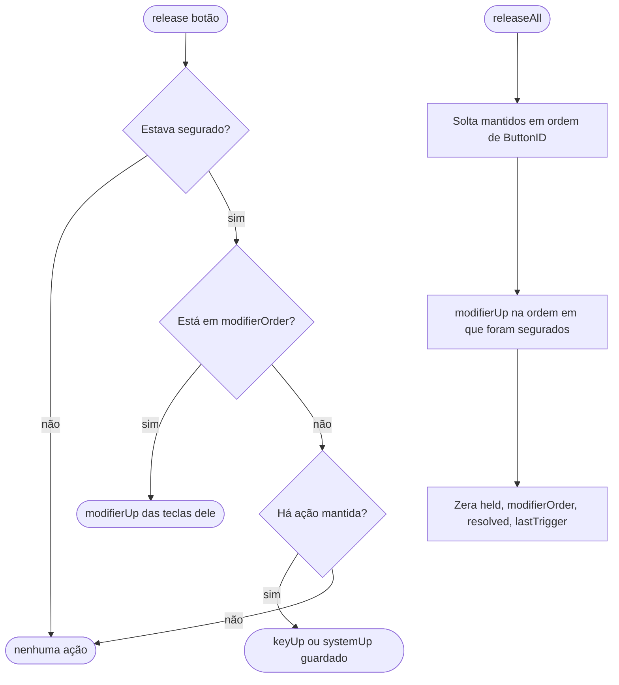
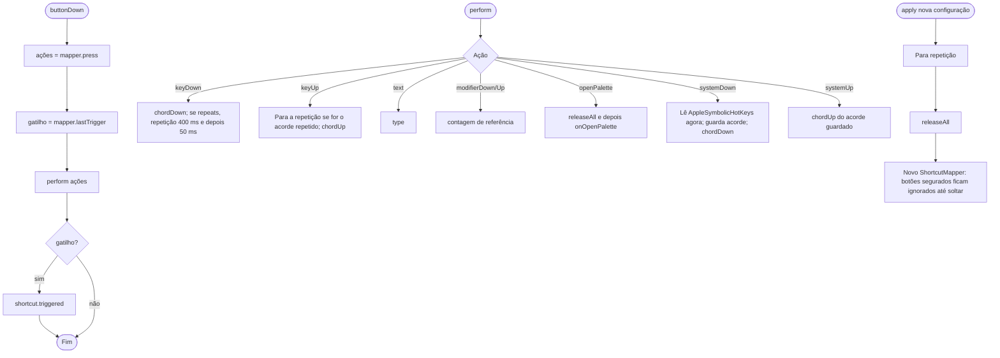
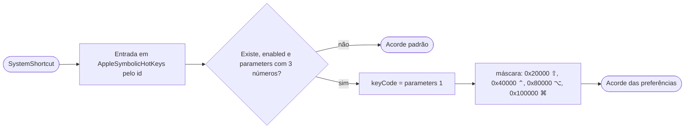

# Fluxogramas — `shortcuts`

> Gerado pelo Arqueólogo em 2026-09-15. Fonte: `ShortcutMapper.swift`, `ShortcutActions.swift`, `ShortcutConfig.swift`. 🟢

## 1. Pressionar (`ShortcutMapper.press`)

## 2. Soltar e soltar tudo

## 3. Execução (`ShortcutActions`)

## 4. Acorde de atalho de sistema

