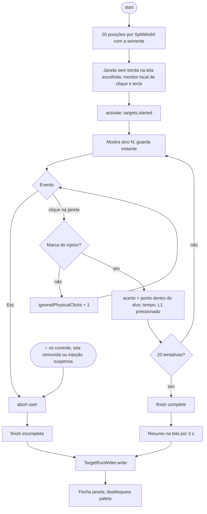
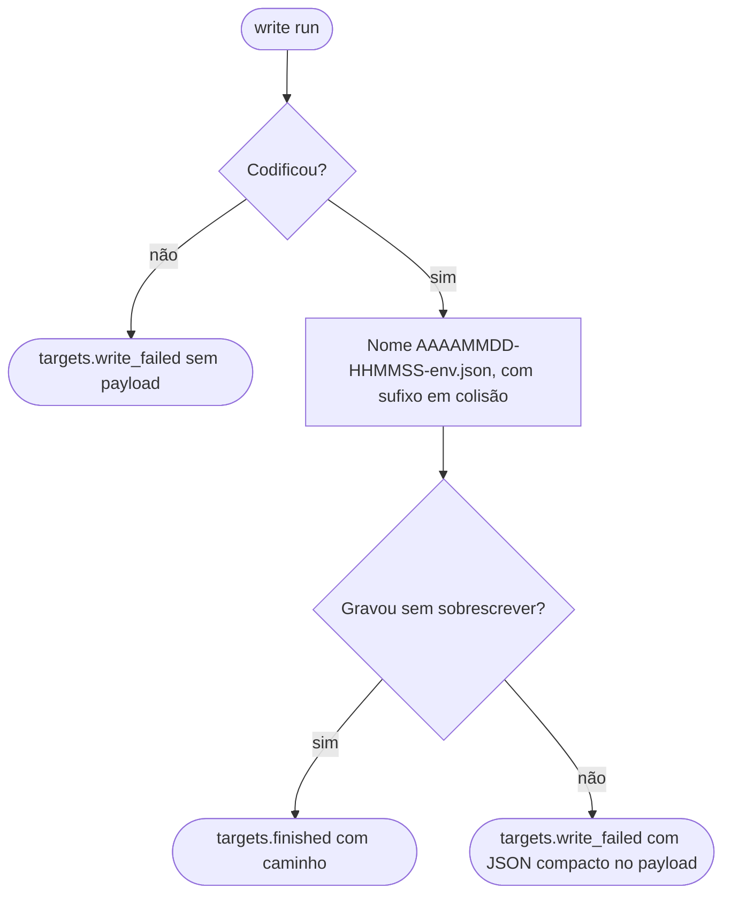
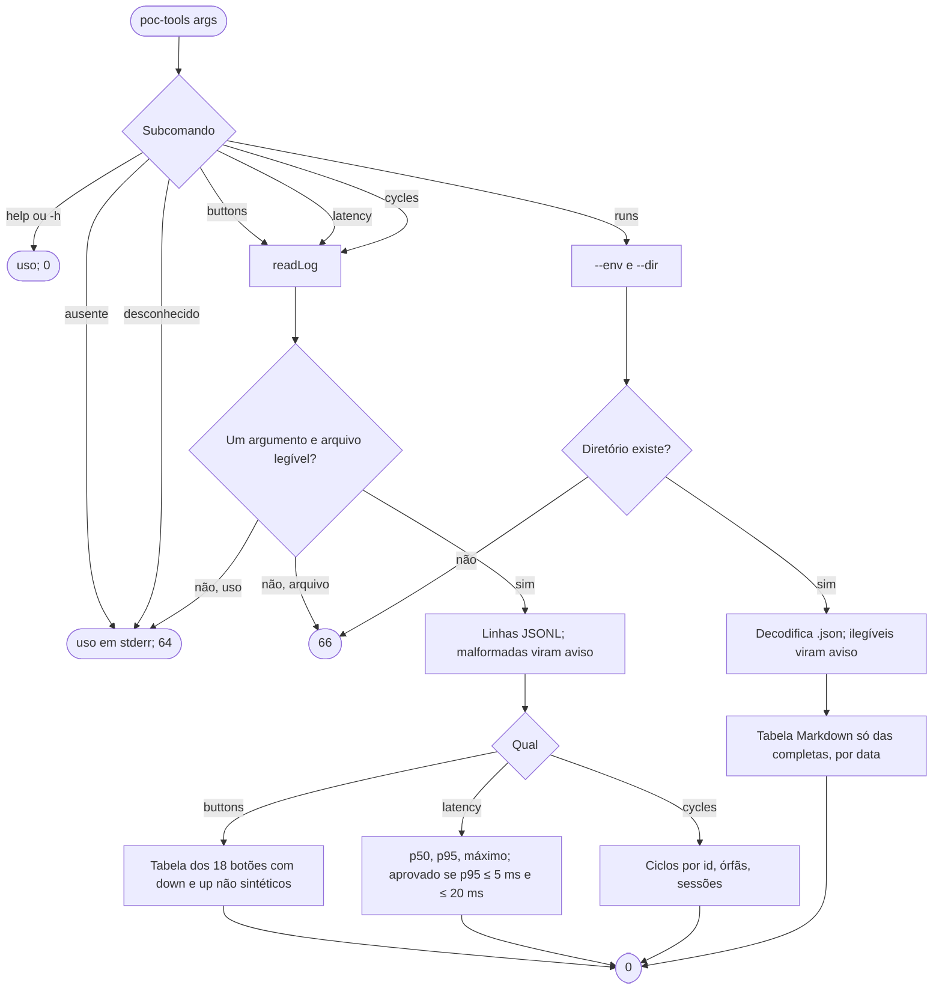

# Fluxogramas — `targets-analysis`

> Gerado pelo Arqueólogo em 2026-09-15. Fonte: `TargetSession.swift`, `TargetAbortMonitor.swift`, `TargetRunWriter.swift`, `TargetRun.swift`, `Sources/poc-tools/`. 🟢

## 1. Sessão da tela de alvos

## 2. Gravação do resultado

## 3. `poc-tools`

