# Máquinas de estado — joystick-AI

> Gerado pelo Detetive em 2026-09-15 · Nível: completo
> Escala: 🟢 CONFIRMADO · 🟡 INFERIDO · 🔴 LACUNA
> O projeto não tem entidades persistidas com campo de status. As máquinas abaixo são estados de execução, quase todas `struct` de valor em `JoystickCore`, serializadas pela fila `input` (`code-analysis.md` §0.1).

## Índice

1. [Controle conectado](#1-controle-conectado)
2. [Permissão de Acessibilidade e portão de injeção](#2-permissão-de-acessibilidade-e-portão-de-injeção)
3. [Paleta](#3-paleta)
4. [Botão do controle no mapeador de atalhos](#4-botão-do-controle-no-mapeador-de-atalhos)
5. [Botões de mouse](#5-botões-de-mouse)
6. [Temporizador de movimento](#6-temporizador-de-movimento)
7. [Toque no touchpad](#7-toque-no-touchpad)
8. [Configuração vigente](#8-configuração-vigente)
9. [Editor](#9-editor)
10. [Sessão da tela de alvos](#10-sessão-da-tela-de-alvos)
11. [Nível `debug` do log](#11-nível-debug-do-log)

---

## 1. Controle conectado

**Dono:** `ActiveControllerRegistry` + `ControllerReader` · 🟢

| Estado | Significado |
|--------|-------------|
| `ignorado` | Controle que não é DualSense; nenhum evento é lido |
| `ativo` | Primeiro da fila; suas entradas produzem efeito |
| `em fila (posição n)` | DualSense conectado depois do ativo |
| `desconectado` | Removido do registro |

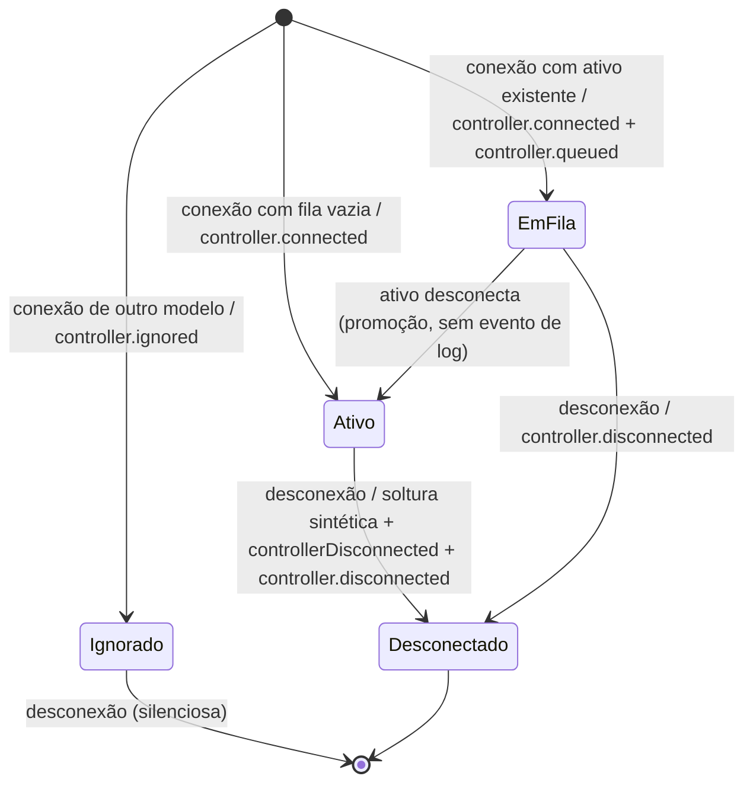

**Invariantes:** no máximo um `ativo`; conexão duplicada do mesmo objeto devolve `.duplicate` sem mudar estado; os pressionados pertencem só ao ativo e são esvaziados na soltura sintética. 🟢

**Observações:** a promoção não é registrada (🟡); o PS lido pelo HID é atribuído ao `ativo` mesmo quando vem do controle em fila (🟡, `domain.md` DV-04).

---

## 2. Permissão de Acessibilidade e portão de injeção

**Dono:** `PermissionMonitor` (main) + `InjectionGate` (fila `input`) · 🟢

| Estado | `injector.enabled` | Significado |
|--------|:-:|-------------|
| `indeterminado` | `false` | Antes da primeira consulta |
| `permitido` | `true` | `AXIsProcessTrusted()` verdadeiro |
| `negado desde o início` | `false` | Primeira consulta negativa; sem registro de suspensão |
| `suspenso` | `false` | Permissão revogada com o app aberto; solturas guardadas |

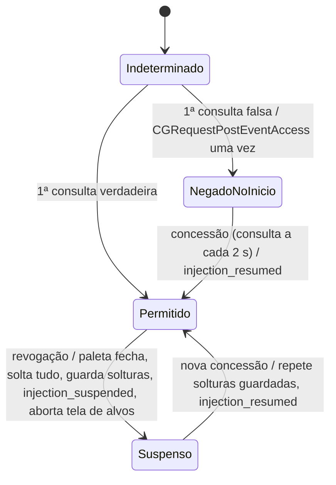

**Evidência de campo:** a transição `Permitido → Suspenso` só é detectada com `AXIsProcessTrusted()`; com `CGPreflightPostEventAccess()` o processo continuava "permitido" enquanto o macOS descartava os eventos (P-08, `validation-report.md` 001:139). 🟢

**Observações:** `listenEvent` (Input Monitoring) é consultado e registrado, mas não tem estado nem efeito (🟢). Em `NegadoNoInicio`, a paleta abre e as confirmações não digitam nada, sem aviso na tela (🟡).

---

## 3. Paleta

**Dono:** `PaletteMachine` (`CommandPalette.swift:86-178`) + `PaletteActions` · 🟢

| Estado | Variáveis |
|--------|-----------|
| `fechada` | `isOpen = false`; `lastConfirmed` preservado |
| `aberta` | `isOpen = true`; `selection ∈ [0, itens]` (o índice `itens` é a entrada fixa) |
| `aberta, repetindo` | direção ↑ ou ↓ mantida; temporizador 400 ms e depois 50 ms |
| `bloqueada` | `blocked = true` enquanto a tela de alvos está aberta (ortogonal) |

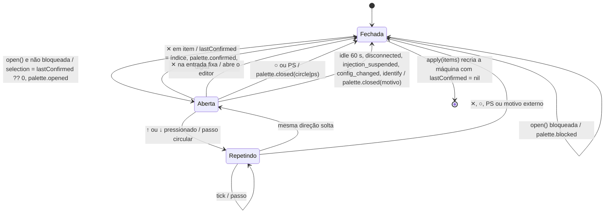

**Invariantes:** a lista nunca é vazia (`precondition`); a seleção é circular sobre `itens + 1`; abrir a paleta solta antes teclas e modificadores (002 RN-04). 🟢

---

## 4. Botão do controle no mapeador de atalhos

**Dono:** `ShortcutMapper` · 🟢. Estado por botão que não é de apontamento.

| Estado | Significado |
|--------|-------------|
| `solto` | Fora de `held` |
| `modificador segurado` | Em `held` e em `modifierOrder`; teclas ⌃⌥⇧⌘ mantidas; define a camada se for o mais antigo |
| `ação mantida` | Em `held` com `resolved[botão]` (acorde ou atalho de sistema) até soltar |
| `ação instantânea` | Em `held` sem `resolved` (texto, abrir paleta, nenhuma) |
| `ignorado até soltar` | Segurado quando o mapeador foi recriado por configuração nova ou por `releaseAll` |

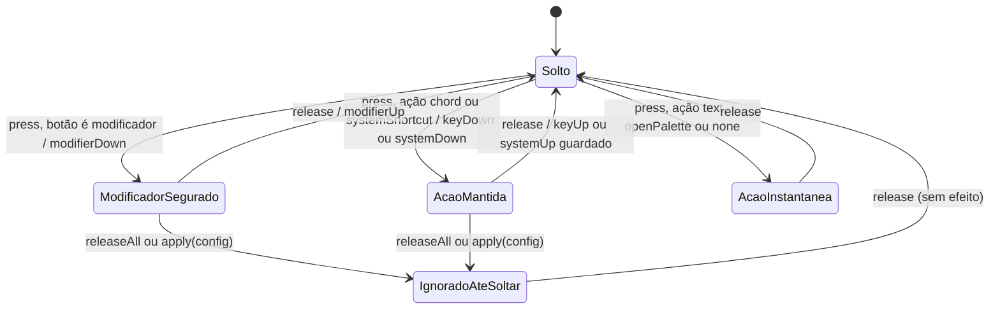

**Regra-chave:** a ação é resolvida no `press` pela camada do modificador segurado há mais tempo e não muda até o `release`, mesmo que o modificador seja solto antes (003 RN-01, RN-03). 🟢

---

## 5. Botões de mouse

**Dono:** `ClickStateMachine` · 🟢

| Estado | Condição |
|--------|----------|
| `esquerdo solto` | `leftHolders` vazio |
| `esquerdo mantido` | R1 e/ou clique do touchpad em `leftHolders` |
| `direito solto` / `direito mantido` | R2 |

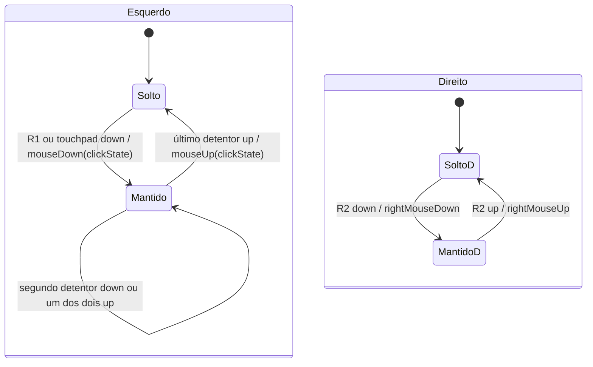

`clickState` = anterior + 1 quando o novo `mouseDown` esquerdo ocorre em até `doubleClickIntervalMs` e 4 pt do anterior; senão 1, sem teto (🟡). Movimento com botão mantido vira `leftMouseDragged` ou `rightMouseDragged`. Desconexão e suspensão executam `releaseAll`. 🟢

---

## 6. Temporizador de movimento

**Dono:** `PointerMotionEngine` + `MotionLoop` · 🟢

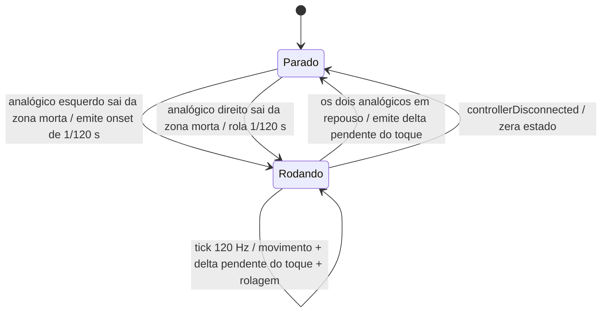

Com o temporizador `Parado`, o delta do touchpad é emitido de imediato; com `Rodando`, acumula para o próximo tick (001 RN-06). 🟢

---

## 7. Toque no touchpad

**Dono:** `ZeroTransitionPhaseInference` + `TouchpadTracker` · 🟢

```mermaid
stateDiagram-v2
    [*] --> SemToque
    SemToque --> Referencia: amostra ≠ (0,0) / began; primário = dedo; fixa referência
    Referencia --> Movendo: amostra seguinte / Δ = (Δx, −Δy) · 400 · sensibilidade
    Movendo --> Movendo: amostra / Δ (descarta atualização por eixo)
    Movendo --> SemToque: amostra = (0,0) / ended
    Referencia --> SemToque: amostra = (0,0) / ended
    Movendo --> Referencia: primário sai com outro dedo presente / novo primário sem salto
```

Via adotada porque `physicalInputProfile.touchpads` vem vazio no DualSense, por USB e por Bluetooth (P-01 da 001). 🟢

---

## 8. Configuração vigente

**Dono:** `ConfigStore` (main) · 🟢

| Estado | `status` | Vigente |
|--------|----------|---------|
| `padrão` | válida, `source = defaults` | `ShortcutDefaults` e 17 itens |
| `do arquivo` | válida, `source = file` | Documento lido ou gravado |
| `inválida` | inválida com problemas e linha | **A anterior**, nunca a inválida |

```mermaid
stateDiagram-v2
    [*] --> Padrao: início sem arquivo ou sem seções
    [*] --> DoArquivo: início com arquivo válido
    [*] --> Invalida: início com arquivo inválido / vigente = padrão
    Padrao --> DoArquivo: releitura ou gravação válida / aplica na fila input
    DoArquivo --> DoArquivo: releitura válida com bytes novos / aplica
    DoArquivo --> DoArquivo: bytes iguais / shortcuts.unchanged
    DoArquivo --> Invalida: releitura inválida / ícone de alerta; vigente mantida
    Padrao --> Invalida: releitura inválida
    Invalida --> DoArquivo: releitura ou gravação válida / aplica; ícone normal
    DoArquivo --> DoArquivo: arquivo removido / shortcuts.file_removed; vigente mantida
```

**Invariante:** 003 RN-08, "configuração inválida nunca substitui a vigente". A única brecha é a gravação confirmada de cópia `.bak` sem revalidação (🟡, `domain.md` DV-05). A seção `pointer` fica fora desta máquina: é congelada no início (🟢).

---

## 9. Editor

**Dono:** `EditorWindowController` + `EditorViewModel` + `EditorDraft` · 🟢

Duas dimensões combinadas: a janela e o rascunho.

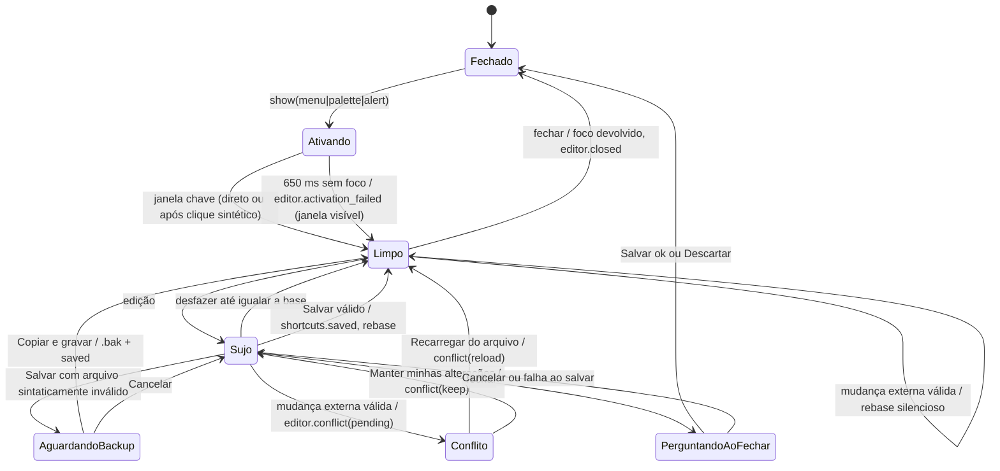

**Subestado ortogonal:** `identificando` liga pelo alternador e desliga ao perder o foco ou fechar; enquanto ligado, a paleta fica fechada e botões não de apontamento só selecionam o gatilho. 🟢

---

## 10. Sessão da tela de alvos

**Dono:** `TargetSession` · 🟢

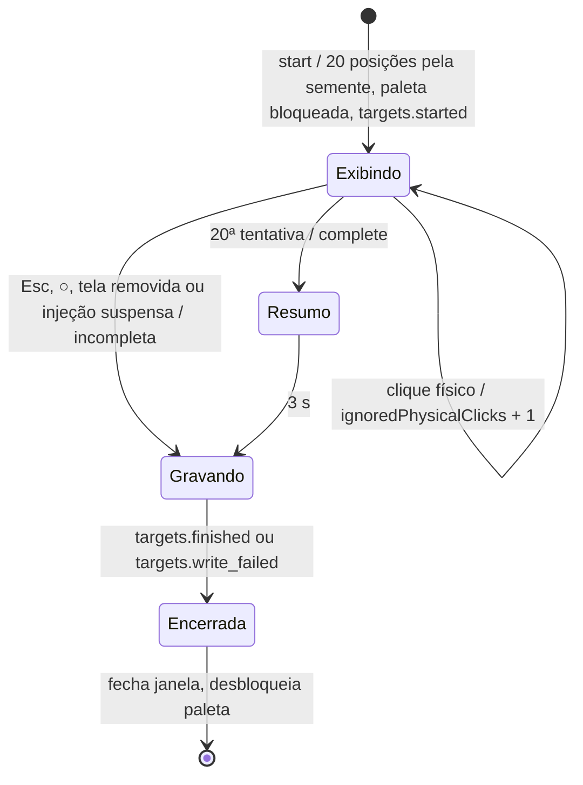

Nos logs locais nenhuma sessão chegou a `Encerrada` com arquivo gravado (`target-runs/` vazio). 🟢

---

## 11. Nível `debug` do log

**Dono:** `DiagnosticLog` · 🟢

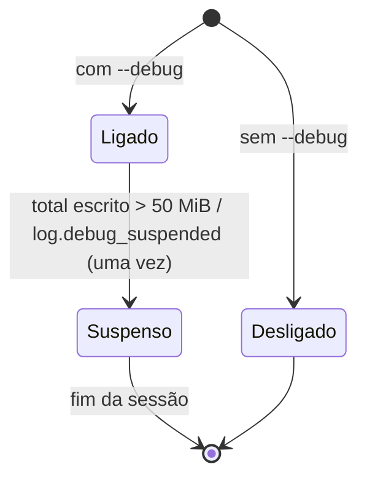

Não há transição de volta a `Ligado` na mesma sessão; `info`, `warn` e `error` continuam sem teto (🟡).
